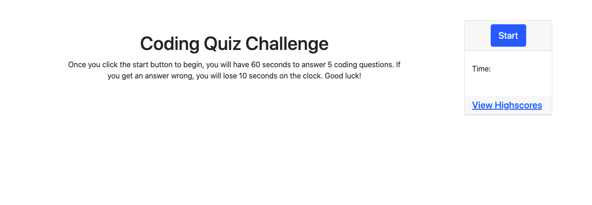
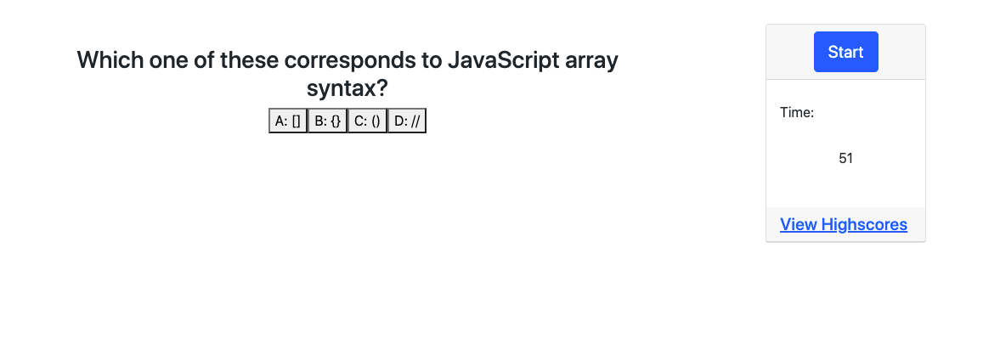
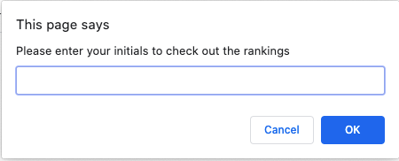
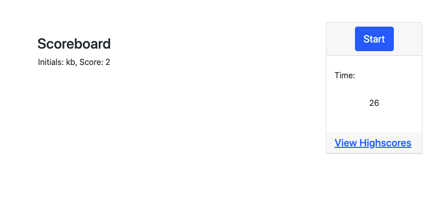
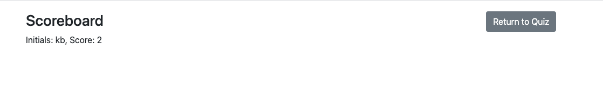

# Overview

The purpose of this assignment was to create a code quiz, with coding questions that presented themselves one at a time, with a timer. The timer was supposed have time docked from it for every wrong answer, and there is a scoreboard at the end to add the user's initials, along with their high score(s). 

# Images

# Link to deployed application
[Code Quiz](https://kelseybenedict.github.io/Code-Quiz/)

